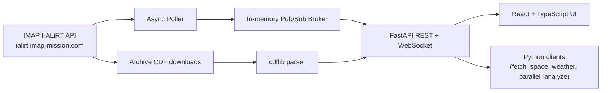

# IMAP I-ALiRT Explorer

Live ingestion, calibration, analytics, and visualization tooling for the
public IMAP I-ALiRT space-weather feed.

The project pairs a Python backend (FastAPI + asyncio pub/sub) with a
React/TypeScript frontend so researchers can subscribe to the instruments
they care about and see calibrated, anomaly-flagged time series update in
near real time.

[](https://github.com/Amrutha-J822/IMAP-I-ALiRT-Explorer/actions)
[](https://www.python.org/)
[](LICENSE)

## What This Solves

I-ALiRT delivers near-real-time IMAP measurements for space-weather
monitoring. Turning that telemetry into actionable views is normally a
multi-step chore: locating files in the Science Data Center, decoding
CDFs, aligning instrument cadences, removing baseline drift, and screening
for events. This project compresses the whole loop into a service:

| Researcher pain point | What the project provides |
| --- | --- |
| File discovery across mission products | `list_available()` wraps the `/ialirt-archive-query` endpoint |
| Live data behind a REST endpoint | `fetch_space_weather()` and a background poller that publishes to subscribers |
| MAG baseline drift and confusing vector plots | `calibrate_mag()` plus a Calibration Lab UI that compares methods side-by-side |
| Event screening by eye | `detect_anomalies()` flags spikes, southward Bz, high-speed streams, particle enhancements |
| Multi-instrument bottlenecks | `parallel_analyze()` fetches and analyzes MAG, SWE, SWAPI, HIT, and CoDICE concurrently |
| Real-time dashboards | FastAPI WebSocket pub/sub plus a React/TS frontend |

## Data Source

The backend talks to the public I-ALiRT API hosted by the IMAP Science
Operations Center at the Laboratory for Atmospheric and Space Physics:

```text
https://ialirt.imap-mission.com
```

The primary live feed is the `/space-weather` endpoint; archived CDF
products are discovered through `/ialirt-archive-query` and downloaded
through `/ialirt-download/archive/<filename>`. Public access does not
require credentials. For protected/unreleased data, set `IMAP_API_KEY`
and point `IALIRT_DATA_ACCESS_URL` at the `/api-key` prefix as documented
by the IMAP SOC.

When the [`ialirt-data-access`](https://github.com/IMAP-Science-Operations-Center/ialirt-data-access)
package is installed, ingestion prefers it for queries and downloads;
otherwise the code falls back to direct REST requests using the same
endpoints.

Supported instruments:

| Instrument | Measurement family | Normalized columns |
| --- | --- | --- |
| `mag` | Magnetic field | `Bx_nT`, `By_nT`, `Bz_nT`, `B_total_nT` |
| `swe` | Solar-wind electrons | `electron_density_cc`, `electron_temp_K`, `heat_flux` |
| `swapi` | Solar-wind ions | `proton_speed_km_s`, `proton_density_cc`, `proton_temp_K` |
| `hit` | Energetic particles | `h_flux`, `he_flux`, `heavy_ion_flux` |
| `codice_lo` | Low-energy ions | `ion_flux_low_energy`, `ion_temp_K` |
| `codice_hi` | High-energy ions | `ion_flux_high_energy`, `energetic_ion_temp_K` |

## Architecture



The pub/sub broker is in-memory and lives inside the FastAPI process. It is
deliberately small: a slow consumer cannot back up the broker because each
subscriber owns a bounded queue and old messages are dropped on overflow.
For multi-process deployments the broker can be swapped for Redis Pub/Sub
or NATS without changing the WebSocket contract.

More detail: [docs/architecture.md](docs/architecture.md).

## Repository Layout

```text
imap-ialirt-explorer/
├── src/ialirt_explorer/
│   ├── ingestion.py          # ialirt-data-access + REST against ialirt.imap-mission.com
│   ├── analytics.py          # statistics, calibration helpers, anomaly detection, pressures
│   ├── parallel.py           # concurrent multi-instrument orchestration
│   ├── visualization.py      # Matplotlib/Seaborn dashboards
│   └── service/
│       ├── api.py            # FastAPI app: REST + WebSocket
│       ├── poller.py         # background task that publishes live samples
│       └── pubsub.py         # async in-memory broker
├── frontend/                 # React + TypeScript (Vite) UI
├── tests/                    # pytest unit and integration tests
├── docs/                     # architecture notes
├── .github/workflows/        # CI on push and pull request
├── demo.py                   # end-to-end Python example pipeline
└── pyproject.toml
```

## Quickstart (Backend)

```bash
python3 -m venv .venv
source .venv/bin/activate
python -m pip install --upgrade pip
python -m pip install -e ".[dev]"
```

Run the live service (FastAPI + background poller + WebSocket):

```bash
ialirt-explorer-service
# equivalent to: uvicorn ialirt_explorer.service.api:app --host 0.0.0.0 --port 8000
```

Useful endpoints (auto-documented at <http://127.0.0.1:8000/docs>):

| Method | Path | Purpose |
| --- | --- | --- |
| `GET` | `/healthz` | Service health + poller status |
| `GET` | `/instruments` | List supported instruments and cadence |
| `GET` | `/snapshot/{instrument}` | One-shot frame + stats + anomalies; supports `?calibrate=true&method=offset` |
| `GET` | `/calibration/mag/suggest` | Heuristic recommendation for the active baseline behavior |
| `GET` | `/calibration/mag/compare` | Run all calibration methods and return quality metrics for each |
| `WS`  | `/ws?instruments=mag,swapi` | Subscribe to live samples; one JSON message per new sample |

Environment variables (see `.env.example`):

```text
IALIRT_DATA_ACCESS_URL=https://ialirt.imap-mission.com
IMAP_API_KEY=
IALIRT_POLL_INTERVAL_SECONDS=30
IALIRT_LOOKBACK_MINUTES=60
IALIRT_SERVICE_HOST=0.0.0.0
IALIRT_SERVICE_PORT=8000
```

## Quickstart (Frontend)

```bash
cd frontend
npm install
npm run dev
```

The Vite dev server runs on <http://127.0.0.1:5173> and proxies `/api`
and `/ws` to the FastAPI service on port 8000. A production build:

```bash
npm run build
npm run preview
```

When a researcher selects an instrument, the UI immediately:

1. Pulls a one-shot snapshot via `/snapshot/{instrument}` and renders the
   time series, summary stats, and anomaly flags.
2. Subscribes to the WebSocket topic for that instrument so any new
   samples published by the poller are appended to the chart in place.
3. For MAG, queries `/calibration/mag/compare` so the Calibration Lab can
   display side-by-side method scores, baseline amplitudes, residual
   drift, and a recommended method.

## Example Usage (Python)

```python
import ialirt_explorer as ie

mag = ie.fetch_latest("mag", days=1)
calibrated = ie.calibrate_mag(mag, method="offset")
quality = ie.calibration_quality(mag, calibrated)
flagged = ie.detect_anomalies(calibrated, "mag", sigma_threshold=3.0)

print(quality["baseline_amplitude_nT"], quality["residual_drift_per_hour_nT"])
print(flagged["any_anomaly"].value_counts())
```

Suggest the right calibration method based on the current data:

```python
recommendation = ie.suggest_calibration_method(mag)
print(recommendation["recommendation"], recommendation["rationale"])

comparison = ie.compare_calibration_methods(mag)
for method, entry in comparison.items():
    print(method, entry["score"], entry["quality"]["residual_drift_per_hour_nT"])
```

Multi-instrument workflow:

```python
results = ie.parallel_analyze(["mag", "swe", "swapi", "hit"], days=1)
for instrument, result in results.items():
    print(instrument, result["stats"]["n_rows"], result["flagged"]["any_anomaly"].sum())
```

## Calibration Lab

`calibrate_mag()` removes baseline drift, but a researcher cannot accept
calibration they cannot inspect. The package exposes three helpers, all
surfaced in the frontend Calibration Lab:

- `compare_calibration_methods(df)` runs `offset`, `detrend`, and
  `zscore` and returns per-component quality metrics for each.
- `calibration_quality(raw, calibrated)` quantifies what calibration did:
  baseline amplitude removed, residual drift per hour, noise floor,
  correlation between raw and calibrated traces, std before and after.
- `suggest_calibration_method(df)` votes per MAG component based on the
  ratio of baseline amplitude and linear trend strength against the noise
  floor, and returns a plain-English rationale for the recommendation.

The UI shows all three methods in one table, highlights the recommended
choice, and lets the researcher apply any of them to the live snapshot
with one click.

## Tests

```bash
pytest
pytest --cov=ialirt_explorer --cov-report=term-missing
```

Coverage focuses on:

- ingestion REST mocks for `/space-weather` and `/ialirt-archive-query`
- deterministic fallback data per instrument
- MAG calibration behavior and `|B|` recomputation
- calibration quality metrics and method recommendation
- rolling z-score and sustained-threshold kernels
- anomaly flags for MAG, SWAPI, SWE, HIT, CoDICE
- solar-wind pressure calculations
- pub/sub broker delivery semantics (matching topics, queue overflow, latest cache)
- FastAPI endpoints with patched ingestion

## CI/CD

`.github/workflows/python-ci.yml` runs on every push and pull request:

1. install the package in editable mode
2. lint `src/` and `tests/` with Ruff
3. run `pytest` with coverage

## Deployment

The backend ships as a single FastAPI process. A typical production
deployment uses `uvicorn` behind a TLS-terminating reverse proxy:

```bash
uvicorn ialirt_explorer.service.api:app --host 0.0.0.0 --port 8000 --workers 1
```

The frontend is a static SPA produced by `npm run build` and can be
served from any CDN or static host. Point it at the FastAPI service via
`VITE_BACKEND_HTTP` and `VITE_BACKEND_WS` at build time.

## Engineering Notes

- No API keys or secrets are committed; the optional `IMAP_API_KEY`
  variable is read at runtime if elevated permissions are needed.
- Live data access is isolated to `ingestion.py`; tests mock network
  behavior.
- Analysis code uses explicit units in column names.
- Numba is optional on Python 3.13, where upstream wheel support may lag;
  the pure-Python fallback keeps the package functional.
- The calibration helpers are transparent screening tools, not
  replacements for mission-level calibration products from the SOC.

## References

- [IMAP Science Operations Center on GitHub](https://github.com/IMAP-Science-Operations-Center)
- [ialirt-data-access on GitHub](https://github.com/IMAP-Science-Operations-Center/ialirt-data-access)
- [IMAP Data Access API documentation](https://imap-processing.readthedocs.io/en/latest/data-access/index.html)
