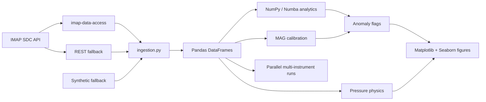

# IMAP I-ALiRT Explorer

Research-grade Python tooling for discovering, loading, calibrating, analyzing,
and visualizing public IMAP I-ALiRT space-weather data.

The project is designed as a small but complete research software engineering
example: official data access, reproducible offline behavior, typed modular
Python, NumPy/Pandas analytics, Numba-ready kernels, publication-quality plots,
pytest coverage, and GitHub Actions CI.

[](https://github.com/Amrutha-J822/IMAP-I-ALiRT-Explorer/actions)
[](https://www.python.org/)
[](LICENSE)

## Why This Matters

I-ALiRT gives researchers near-real-time IMAP measurements for space-weather
monitoring. The scientific value is high, but the workflow can be slow:
researchers must discover files, download mission-format data, align
multi-instrument timestamps, inspect calibration drift, and produce readable
figures before they can ask the actual science question.

This project focuses on that pain point. It turns I-ALiRT data into clean,
analysis-ready DataFrames and flags candidate events fast enough for interactive
research.

| Research pain point | What the project provides |
| --- | --- |
| File discovery across mission products | `list_available()` wraps the official SDC query interface |
| Live data loading with unstable networks | Official `imap-data-access` first, REST second, deterministic fallback for CI |
| MAG baseline drift and confusing vector plots | `calibrate_mag()` normalizes vector components and recomputes `|B|` |
| Event screening by eye | `detect_anomalies()` flags spikes, southward Bz intervals, high-speed streams, and particle enhancements |
| Multi-instrument bottlenecks | `parallel_analyze()` fetches and analyzes MAG, SWE, SWAPI, and HIT concurrently |

## Data Source

The primary data path is the official `imap-data-access` Python package, which
queries and downloads files from the IMAP Science Data Center API:

```text
https://api.imap-mission.com
```

Public I-ALiRT access does not require API keys. Optional authentication
variables are supported in `.env.example` for protected or unreleased products,
but this repository does not contain secrets.

Supported instruments:

| Instrument | Measurement family | Normalized columns |
| --- | --- | --- |
| `mag` | Magnetic field | `Bx_nT`, `By_nT`, `Bz_nT`, `B_total_nT` |
| `swe` | Solar-wind electrons | `electron_density_cc`, `electron_temp_K`, `heat_flux` |
| `swapi` | Solar-wind ions | `proton_speed_km_s`, `proton_density_cc`, `proton_temp_K` |
| `hit` | Energetic particles | `h_flux`, `he_flux`, `heavy_ion_flux` |

## Architecture



More detail: [docs/architecture.md](docs/architecture.md)

## Repository Layout

```text
imap-ialirt-explorer/
├── src/ialirt_explorer/
│   ├── ingestion.py       # official IMAP SDC package, REST fallback, CDF parsing
│   ├── analytics.py       # NumPy statistics, calibration, anomaly detection, pressure physics
│   ├── parallel.py        # concurrent multi-instrument orchestration
│   └── visualization.py   # Matplotlib/Seaborn dashboards
├── tests/                 # pytest unit tests with mocks and parametrization
├── docs/                  # architecture notes
├── .github/workflows/     # CI on push and pull request
├── demo.py                # end-to-end example pipeline
├── pyproject.toml         # package metadata and tool config
├── requirements.txt       # pip-friendly dependency list
└── .env.example           # documented optional environment variables
```

## Quickstart

```bash
python3 -m venv .venv
source .venv/bin/activate
python -m pip install --upgrade pip
python -m pip install -e ".[dev]"
```

Run the full demo:

```bash
python demo.py
```

The demo writes:

```text
output_mag_dashboard.png
output_mag_timeseries.png
output_mag_hodogram.png
output_anomaly_summary.png
output_multi_instrument.png
```

If the live API or CDF parser is unavailable, the same pipeline runs against
deterministic physically plausible data. That makes interviews, CI, and offline
development reproducible.

## Example Usage

```python
import ialirt_explorer as ie

mag = ie.fetch_latest("mag", days=3)
calibrated = ie.calibrate_mag(mag, method="offset")
flagged = ie.detect_anomalies(calibrated, "mag", sigma_threshold=3.0)

print(ie.analyze(calibrated))
print(flagged["any_anomaly"].value_counts())

ie.plot_dashboard(calibrated, instrument="mag", save_path="mag_dashboard.png")
```

Multi-instrument workflow:

```python
results = ie.parallel_analyze(["mag", "swe", "swapi", "hit"], days=2)
for instrument, result in results.items():
    print(instrument, result["stats"]["n_rows"], result["flagged"]["any_anomaly"].sum())
```

Pressure calculation:

```python
mag = ie.calibrate_mag(ie.fetch_latest("mag", days=3))
swapi = ie.fetch_latest("swapi", days=3)
pressure = ie.compute_pressures(mag, swapi)
print(pressure[["P_ram_nPa", "P_mag_nPa", "P_total_nPa", "plasma_beta"]].tail())
```

## Tests

```bash
pytest
pytest tests/test_analytics.py -q
pytest --cov=ialirt_explorer --cov-report=term-missing
```

Coverage focuses on:

- instrument schema validation and deterministic fallback data
- mocked SDC query parsing
- MAG calibration behavior and `|B|` recomputation
- rolling z-score and sustained-threshold kernels
- anomaly flags for MAG, SWAPI, SWE, and HIT
- solar-wind pressure calculations
- parallel orchestration result shape

## CI/CD

`.github/workflows/python-ci.yml` runs on every push and pull request:

1. install the package in editable mode
2. lint `src/` and `tests/` with Ruff
3. run `pytest` with coverage

This mirrors the kind of reproducible review workflow expected in a research
software engineering team.

## Deployment

The core project is a Python research package and does not need deployment.
For a lightweight web version, the current package can be wrapped by a small
FastAPI service and deployed behind a static Vercel or Netlify frontend. The
existing API boundaries were chosen so that the backend can stay server-side and
the browser never needs IMAP credentials or mission-specific data logic.

## Notes For Reviewers

- No API keys or secrets are committed.
- Live data access is isolated to `ingestion.py`; tests mock network behavior.
- Analysis code uses explicit units in column names.
- Numba is optional on Python 3.13, where upstream wheel support may lag; the
  pure-Python fallback keeps the package functional.
- Algorithms are intentionally transparent screening tools, not mission
  calibration replacements.

## References

- [IMAP Data Access API documentation](https://imap-processing.readthedocs.io/en/latest/data-access/index.html)
- [imap-data-access on PyPI](https://pypi.org/project/imap-data-access/)
