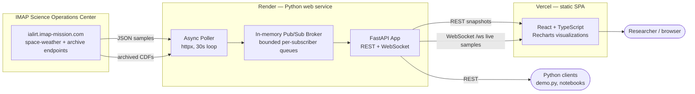

# IMAP I-ALiRT Explorer

> **A live dashboard for NASA's IMAP satellite.** It pulls solar-weather measurements off the spacecraft as they stream down, cleans up the magnetic-field signal, flags unusual activity, and plots everything on a chart that updates in real time.

[](https://github.com/Amrutha-J822/IMAP-I-ALiRT-Explorer/actions)
[](https://www.python.org/)
[](LICENSE)

## Live Demo

| | URL |
| --- | --- |
| Web app (Vercel) | <https://imap-ialirt-explorer.vercel.app> |
| Backend API (Render) | <https://imap-ialirt-explorer-api.onrender.com> |
| Backend health | <https://imap-ialirt-explorer-api.onrender.com/healthz> |
| OpenAPI docs | <https://imap-ialirt-explorer-api.onrender.com/docs> |

The Render backend uses the free tier and sleeps after ~15 minutes of inactivity; the first request after a sleep takes ~30 s to cold-start, then the WebSocket reconnects automatically.

## What This Solves

I-ALiRT delivers near-real-time IMAP measurements for space-weather monitoring. Turning that telemetry into something a researcher can actually look at is normally a multi-step chore: locating files in the Science Data Center, decoding CDFs, aligning instrument cadences, removing baseline drift, screening for events. This project compresses the whole loop into a service.

| Researcher pain point | What the project provides |
| --- | --- |
| File discovery across mission products | `list_available()` wraps the `/ialirt-archive-query` endpoint |
| Live data behind a REST endpoint | `fetch_space_weather()` plus a background poller that publishes to subscribers |
| MAG baseline drift and confusing vector plots | `calibrate_mag()` plus a Calibration Lab UI that compares methods side-by-side |
| Event screening by eye | `detect_anomalies()` flags spikes, southward Bz, high-speed streams, particle enhancements |
| Multi-instrument bottlenecks | `parallel_analyze()` fetches and analyzes MAG, SWE, SWAPI, HIT, and CoDICE concurrently |
| Real-time dashboards | FastAPI WebSocket pub/sub plus a React/TS frontend |

## Architecture



The broker is deliberately small and in-process: a slow consumer cannot back up the broker because each subscriber owns a bounded queue, and old messages are dropped on overflow. For multi-process deployments the broker can be swapped for Redis Pub/Sub or NATS without changing the WebSocket contract.

More detail: [docs/architecture.md](docs/architecture.md).

## Data Source

The backend talks to the public I-ALiRT API hosted by the IMAP Science Operations Center at the Laboratory for Atmospheric and Space Physics:

```text
https://ialirt.imap-mission.com
```

The live feed is the `/space-weather` endpoint; archived CDF products are discovered through `/ialirt-archive-query` and downloaded through `/ialirt-download/archive/<filename>`. Public access does not require credentials. For protected or unreleased data, set `IMAP_API_KEY` and point `IALIRT_DATA_ACCESS_URL` at the `/api-key` prefix as documented by the IMAP SOC.

When the [`ialirt-data-access`](https://github.com/IMAP-Science-Operations-Center/ialirt-data-access) package is installed, ingestion prefers it for queries and downloads; otherwise the code falls back to direct REST requests.

### Supported instruments

| Instrument | Cadence | Normalized columns |
| --- | --- | --- |
| `mag` | 4 s | `Bx_nT`, `By_nT`, `Bz_nT`, `B_total_nT` |
| `swapi` | 30 s | `proton_speed_km_s`, `proton_density_cc`, `proton_temp_K` |
| `swe` | 12 s | `electron_counts_mean`, `electron_counts_max`, `counterstreaming_flag` |
| `hit` | 60 s | `h_low_en`, `h_med_en`, `he_low_en`, `he_high_en`, `e_a_med_en`, `e_b_med_en` |
| `codice_lo` | 60 s | `c_over_o`, `fe_over_o`, `mg_over_o`, `o7_over_o6`, `c6_over_c5`, `fe_low_over_fe_high` |
| `codice_hi` | 60 s | `h_e0`, `h_e1`, `h_e2`, `h_e3` |

## Repository Layout

```text
imap-ialirt-explorer/
├── src/ialirt_explorer/
│   ├── ingestion.py          # ialirt-data-access + REST against ialirt.imap-mission.com
│   ├── analytics.py          # statistics, calibration, anomaly detection
│   ├── parallel.py           # concurrent multi-instrument orchestration
│   ├── visualization.py      # Matplotlib/Seaborn dashboards
│   └── service/
│       ├── api.py            # FastAPI app: REST + WebSocket
│       ├── poller.py         # background task that publishes live samples
│       └── pubsub.py         # async in-memory broker
├── frontend/                 # React + TypeScript (Vite) UI
├── tests/                    # pytest unit and integration tests
├── docs/                     # architecture notes
├── .github/workflows/        # CI on push and pull request
├── render.yaml               # Render blueprint for the backend service
├── Dockerfile                # alternative container deploy
├── demo.py                   # end-to-end Python example pipeline
└── pyproject.toml
```

## Quickstart (Backend)

```bash
python3 -m venv .venv
source .venv/bin/activate
python -m pip install --upgrade pip
python -m pip install -e ".[dev]"
ialirt-explorer-service
```

That starts FastAPI + the background poller + the WebSocket server on <http://127.0.0.1:8000>. OpenAPI docs are auto-served at `/docs`.

| Method | Path | Purpose |
| --- | --- | --- |
| `GET` | `/healthz` | Service health + poller status |
| `GET` | `/instruments` | List supported instruments and cadence |
| `GET` | `/snapshot/{instrument}` | One-shot frame + stats + anomalies; supports `?calibrate=true&method=offset` |
| `GET` | `/calibration/mag/suggest` | Heuristic recommendation for the active baseline behavior |
| `GET` | `/calibration/mag/compare` | Run all calibration methods and return quality metrics for each |
| `WS`  | `/ws?instruments=mag,swapi` | Subscribe to live samples; one JSON message per new sample |

Configuration via environment variables (see `.env.example`):

```text
IALIRT_DATA_ACCESS_URL=https://ialirt.imap-mission.com
IMAP_API_KEY=
IALIRT_POLL_INTERVAL_SECONDS=30
IALIRT_LOOKBACK_MINUTES=60
PORT=8000           # honored on Render / Heroku / Cloud Run
```

## Quickstart (Frontend)

```bash
cd frontend
npm install
npm run dev
```

The Vite dev server runs on <http://127.0.0.1:5173> and proxies `/api` and `/ws` to the FastAPI service on port 8000. When selecting an instrument the UI:

1. Pulls a one-shot snapshot via `/snapshot/{instrument}` and renders the time series, summary stats, and anomaly flags.
2. Subscribes to the WebSocket topic so new samples published by the poller are appended to the chart in place.
3. For MAG, queries `/calibration/mag/compare` so the Calibration Lab can display side-by-side method scores, baseline amplitudes, residual drift, and a recommended method.

Production build (what's shipped to Vercel):

```bash
npm run build && npm run preview
```

## Example Usage (Python)

```python
import ialirt_explorer as ie

mag = ie.fetch_latest("mag", days=1)
calibrated = ie.calibrate_mag(mag, method="offset")
quality = ie.calibration_quality(mag, calibrated)
flagged = ie.detect_anomalies(calibrated, "mag", sigma_threshold=3.0)

print(quality["baseline_amplitude_nT"], quality["residual_drift_per_hour_nT"])
print(flagged["any_anomaly"].value_counts())

recommendation = ie.suggest_calibration_method(mag)
print(recommendation["recommendation"], recommendation["rationale"])

results = ie.parallel_analyze(["mag", "swe", "swapi", "hit"], days=1)
for instrument, result in results.items():
    print(instrument, result["stats"]["n_rows"], result["flagged"]["any_anomaly"].sum())
```

## Calibration Lab

`calibrate_mag()` removes baseline drift, but a researcher cannot accept calibration they cannot inspect. The package exposes three helpers, all surfaced in the frontend Calibration Lab:

- `compare_calibration_methods(df)` runs `offset`, `detrend`, and `zscore` and returns per-component quality metrics for each.
- `calibration_quality(raw, calibrated)` quantifies what calibration did: baseline amplitude removed, residual drift per hour, noise floor, correlation between raw and calibrated traces, std before and after.
- `suggest_calibration_method(df)` votes per MAG component based on the ratio of baseline amplitude and linear trend strength against the noise floor, and returns a plain-English rationale for the recommendation.

The UI shows all three methods in one table, highlights the recommended choice, and lets the researcher apply any of them to the live snapshot with one click.

## Tests

```bash
pytest
pytest --cov=ialirt_explorer --cov-report=term-missing
```

Coverage focuses on: REST mocks for `/space-weather` and `/ialirt-archive-query`, fallback synthetic data per instrument, MAG calibration behavior and `|B|` recomputation, calibration quality metrics and method recommendation, rolling z-score and sustained-threshold kernels, anomaly flags for MAG / SWAPI / SWE / HIT / CoDICE, solar-wind pressure calculations, pub/sub broker delivery semantics, and FastAPI endpoints with patched ingestion.

CI (`.github/workflows/python-ci.yml`) runs on every push and pull request: installs the package, lints with Ruff, and runs `pytest` with coverage.

## Deployment

The live demo is deployed exactly as described in this repo:

- **Backend (Render):** the `render.yaml` blueprint provisions a Python web service that runs `pip install .` then `ialirt-explorer-service`. The service binds to `$PORT` (Render-standard) and exposes a `/healthz` health check.
- **Frontend (Vercel):** a static SPA produced by `npm run build`, deployed from the `frontend/` directory. The Vercel project has `VITE_BACKEND_HTTP=https://imap-ialirt-explorer-api.onrender.com` and `VITE_BACKEND_WS=wss://imap-ialirt-explorer-api.onrender.com` so the bundle can find the backend at build time.

A `Dockerfile` is included as an alternative if you'd rather containerize the backend for Fly.io, Cloud Run, Railway, or any other container host.

## Engineering Notes

- No API keys or secrets are committed. The optional `IMAP_API_KEY` is read at runtime if elevated permissions are needed.
- Live data access is isolated to `ingestion.py`; tests mock all network behavior.
- Analysis code uses explicit units in column names (`_nT`, `_km_s`, `_cc`, `_K`).
- Numba is optional on Python 3.13, where upstream wheel support may lag; the pure-Python fallback keeps the package functional.
- The calibration helpers are transparent screening tools, not replacements for mission-level calibration products from the SOC.

## References

- [IMAP Science Operations Center on GitHub](https://github.com/IMAP-Science-Operations-Center)
- [ialirt-data-access on GitHub](https://github.com/IMAP-Science-Operations-Center/ialirt-data-access)
- [IMAP Data Access API documentation](https://imap-processing.readthedocs.io/en/latest/data-access/index.html)
