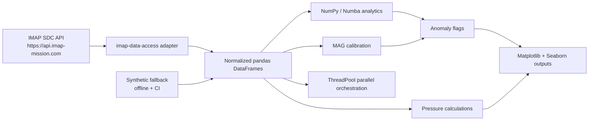

# Architecture

IMAP I-ALiRT Explorer is intentionally small, but it follows the same boundaries
expected in a larger research software stack.

## Design choices

- **Official data access first:** `ialirt_explorer.ingestion` calls
  `imap_data_access.query()` and `imap_data_access.download()` before falling
  back to direct REST calls.
- **Stable schema:** each instrument is normalized to explicit column names so
  analysis code is decoupled from CDF variable naming differences.
- **Reproducible offline mode:** deterministic fallback data makes demos and CI
  independent of remote API availability.
- **Transparent algorithms:** calibration and anomaly rules are documented,
  typed, and deliberately conservative. They are screening aids for researchers,
  not replacements for mission-level calibration.
- **Parallel by default:** multi-instrument workflows use
  `ThreadPoolExecutor`, which maps cleanly to Dask or HPC schedulers later.
