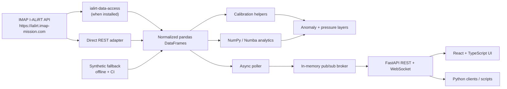

# Architecture

IMAP I-ALiRT Explorer is intentionally small but follows the same
boundaries expected in a larger research-software stack. The system has
three logical layers: a data-access layer, a service layer that fans live
samples out via pub/sub, and a presentation layer (Python clients,
Matplotlib figures, and a React/TypeScript UI).

## Layers

- **Ingestion (`ialirt_explorer.ingestion`)**

  Prefers the official `ialirt-data-access` package for queries and
  downloads. Falls back to direct REST against the documented public
  endpoints (`/space-weather`, `/ialirt-archive-query`,
  `/ialirt-download/archive/<filename>`). A deterministic synthetic
  generator keeps the rest of the system functional when the upstream is
  unreachable.

- **Analytics (`ialirt_explorer.analytics`)**

  Calibration (offset, detrend, z-score), quality metrics that quantify
  what calibration did to the data, a heuristic that recommends the best
  method for the current MAG behavior, Numba-JIT statistical kernels,
  instrument-specific anomaly rules, and solar-wind pressure terms.

- **Service (`ialirt_explorer.service`)**

  - `pubsub.py` is the in-memory async broker. Each subscriber owns a
    bounded queue; on overflow the oldest message is dropped so a slow
    consumer cannot stall the broker.
  - `poller.py` runs as a background `asyncio` task. It periodically
    fetches the `/space-weather` endpoint per instrument, deduplicates
    against the last-seen timestamp, and publishes one message per new
    sample to the per-instrument topic.
  - `api.py` is the FastAPI application. It exposes REST endpoints for
    snapshots and calibration tools, and a WebSocket endpoint that
    subscribes a client to one or more instrument topics. The latest
    message per topic is replayed on connect so a new client sees the
    most recent reading immediately.

- **Presentation**

  Two parallel front ends share the same Python core:

  - `visualization.py` produces publication-ready Matplotlib/Seaborn
    figures for static reports and notebooks.
  - `frontend/` is a Vite + React + TypeScript SPA that calls the REST
    endpoints for snapshots and the WebSocket for live updates.

## Design choices

- **Official data access first.** Use `ialirt-data-access` when available;
  the direct REST adapter is a clean fallback that uses the same documented
  endpoints.
- **Stable schema.** Each instrument is normalized to explicit column
  names so analysis code is decoupled from raw payload differences.
- **Reproducible offline mode.** A deterministic synthetic generator
  keeps the service, dashboards, and CI functional without network.
- **Transparent algorithms.** Calibration and anomaly rules are
  documented, typed, and deliberately conservative. They are screening
  aids, not replacements for SOC mission products.
- **Pub/sub by default.** Live samples flow through an async broker so
  new subscribers can join without the poller having to know about them.
  The broker is swappable: the same topic-and-message contract can be
  served by Redis Pub/Sub or NATS for multi-process deployments.
- **Parallel multi-instrument analysis.** `parallel_analyze` uses a
  `ThreadPoolExecutor` that maps cleanly to Dask or HPC schedulers later.
